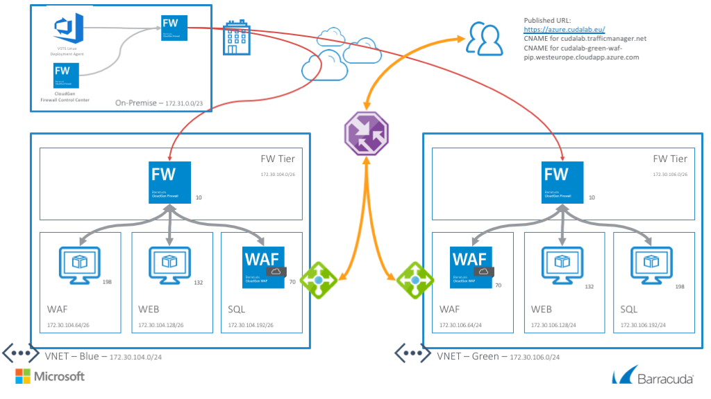
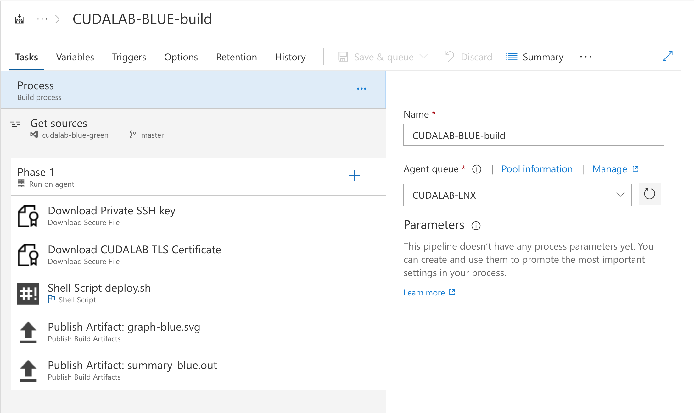
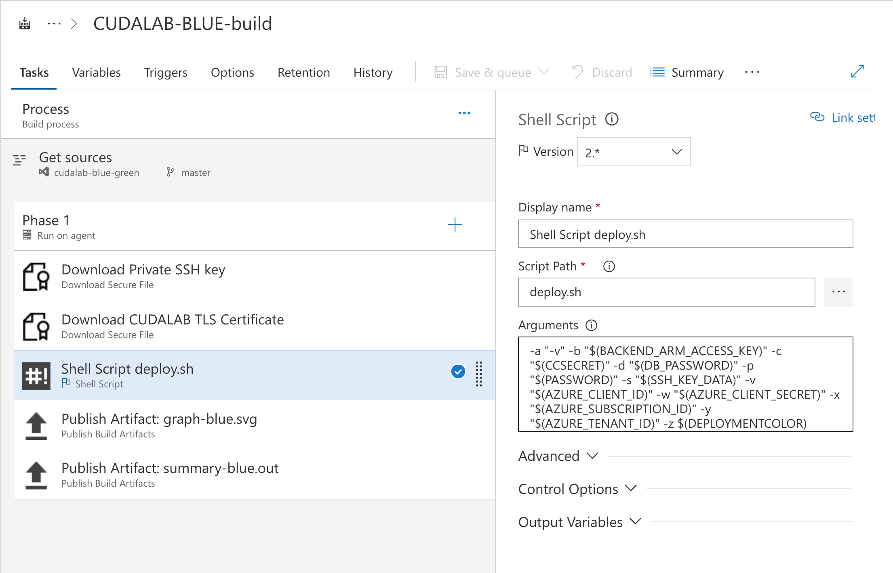
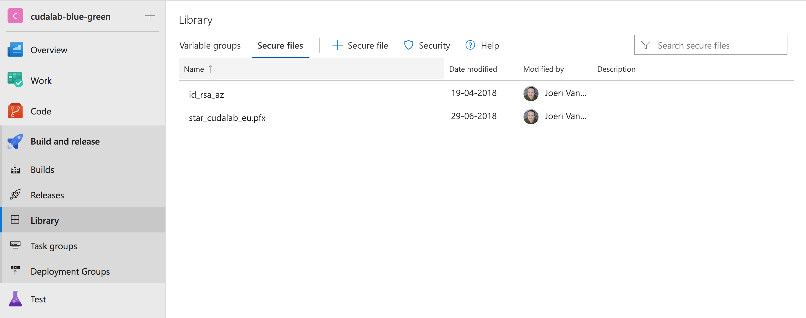

# Barracuda CloudGen Firewall and Web Application Firewall - Blue / Green deployment

## Introduction
Since the begining of time people have tried to automate tasks. Also in computer sience we have seen this from the early days. One limition was the infrastructure that needed to be in place for automation to commence. With virtualisation and public cloud this automation has come full circle and we can now deploy, manage, redeploy everything using automation techniques. We can descibe the operating environment in code, validate it, test it, document it and deploy it from a code repository. 

This is a giant change compared to the typical laborious deployment of infrastructure through cli, web ui, client or other. 

The purpose of this demo is to showcase how you can create, configure and secure your whole environment from code.

## Prerequisites
The tools used in this setup are HashiCorp Terraform (> 0.11.x) and RedHat Ansible (> 2.x). Both tools have their pro's and con's. Working together they help maintaining the state of your infrastructure and the ensures the configuration is correct. The deployment can be done from either a bash shell script or from any CI tool. In our case we used Visual Studio Team Services (VSTS). The LINUX VSTS agent requires the Ansible and Terraform tools to be installed as well as the VSTS agent.

## Deployed resources
Following resources will be created by this deployment per color:
- One virtual network with CGF, WAF, WEB and SQL subnets
- Routing for the WEB and SQL subnets
- One CGF virtual machine with a network interface and public IP in a Availability Set
- One WAF virtual machine with a network interface and public IP in a Availability Set
- One WEB Linux virtual machine with a network interface
- One SQL Linux virtual machine with a network interface
- Two external Azure Basic Load Balancer, containing either the CGF or WAF virtual machines with a public IP and services for HTTP, HTTPS IPSEC and/or TINA VPN tunnels
- Azure Traffic Manager to switch from Blue to Green deployment and back

## Launching the Template

Ideally the deployment of the Blue or Green environments is done using Visual Studio Team Services (VSTS) or another CI/CD tools. In this reference architecture we used VSTS. The deployment is also possible from a CLI that provides the Terraform and Ansible tools. Within Azure this is certainly possible with the Azure Cloud Shell which contains both.

The package provides a deploy.sh and destroy.sh scripts which will build or remove the whole setup per color when the correct arguments are supplied as well as the correct environment variables are set. For VSTS you can find the build configuration files in the resources/vsts directory. For CLI we recommand the deployment from the Azure Cloud Shell as this comes pre-installed with the reqiured tools. 

For the Barracuda CGF it is also required to have a Barracuda CloudGen Firewall Control Center ready to go. This Control Center 

### Checklist - Local deployment

- [Azure Cloud Shell](https://azure.microsoft.com/en-us/features/cloud-shell/)
- [Barracuda CloudGen Firewall Control Center](https://campus.barracuda.com/product/cloudgenfirewall/doc/73719437/getting-started-control-center-for-microsoft-azure/)
- [Azure Storage Account for the Terraform state](https://www.terraform.io/docs/backends/types/azurerm.html)
- [Azure AD Service Principal](https://docs.microsoft.com/en-us/cli/azure/create-an-azure-service-principal-azure-cli?view=azure-cli-latest)

### Checklist - VSTS deployment

- [Visual Studio Team Services](https://visualstudio.microsoft.com/team-services/)
- [Barracuda CloudGen Firewall Control Center](https://campus.barracuda.com/product/cloudgenfirewall/doc/73719437/getting-started-control-center-for-microsoft-azure/)
- [Azure Storage Account for the Terraform state](https://www.terraform.io/docs/backends/types/azurerm.html)
- [Azure AD Service Principal](https://docs.microsoft.com/en-us/cli/azure/create-an-azure-service-principal-azure-cli?view=azure-cli-latest)

## Deployment - Local Deployment

- Start up Azure Cloud Shell from the Azure Portal or go directly to [https://shell.azure.com](https://shell.azure.com/)
- Download the latest version of the of templates in the persistant clouddrive:
`cd ~/clouddrive/ && wget -qO- https://github.com/jvhoof/cudalab-blue-green-azure/archive/master.zip | jar xv && cd ~/clouddrive/cudalab-blue-green-azure-master/`
- Fill in the deploy-local.sh and var-blue.env and/or var-green.env. 

## deploy.sh and destroy.sh Parameters
The script requires certain environment variables as well as some arguments. 

| Argument | Deploy | Destroy | Parameter Name | Description
|---|---|---|---|---
-a | X | - | ANSIBLEOPTS | Extra Ansible deployment options (can be used for debugging (-vvv))
-b | X | X | BACKEND_ARM_ACCESS_KEY | Azure Storage Access Key for the Terraform state file
-c | X | - | CCSECRET | CloudGen Control Center secret for this firewall
-d | X | X | DB_PASSWORD | Database root password
-p | X | - | PASSWORD | Password for all virtual machines
-s | X | - | SSH_KEY_DATA | SSH Public Key to access the linux vm's
-v | X | X | AZURE_CLIENT_ID | Azure application id
-w | X | X | AZURE_CLIENT_SECRET | Azure application id client secret
-x | X | X | AZURE_SUBSCRIPTION_ID | Azure Subscription ID
-y | X | X | AZURE_TENANT_ID | Azure Tenant ID
-z | X | X | DEPLOYMENTCOLOR | Which version do you want to deploy... [blue|green]

## Environment Variables

| Variable Name | Description
|---|---
BACKEND_STORAGE_ACCOUNT_NAME | Azure Storage Account Name for the Terraform state file
BACKEND_CONTAINER_NAME | Azure Storage Container Name for the Terraform state file
BACKEND_KEY_COLOR | Azure Storage File Name of the Terraform state file
BACKEND_KEY_TM | Azure Storage File Name of the Terraform state file for the Traffic Manager deployment
TF_VAR_CCRANGEID | CloudGen Control Center Range numeric identifier
TF_VAR_CCCLUSTERNAME | CloudGen Control Center Cluster name identifier
TF_VAR_CCIPADDRESS | CloudGen Control Center public ip addres reachable on port 806 to fetch the configuration
TF_VAR_CFGVMNAME | CloudGen Control Center firewall name
TF_VAR_LOCATION | Azure datacenter location to deploy the environment
TF_VAR_PREFIX | Prefix text for all deployed resources
TF_VAR_TMDNSNAME | Azure Traffic Manager DNS name
TF_VAR_WAF_LICENSE_TOKENS | License tokens for the Barracuda CloudGen WAF BYOL VM's
DOWNLOADSECUREFILE1_SECUREFILEPATH | The location of the SSH private key used to connect to the backend servers
DOWNLOADSECUREFILE2_SECUREFILEPATH | The location of the PFX file containing the TLS certificate for the LAB

## Detailed deployment & configuration steps

The deployment using VSTS is done is different steps. From a network point of view the configuration from the Barracuda CloudGen Firewall is pulled from the Firewall Control Center On-Premise. This contains the whole configuration of the CloudGen Firewall and will automatically establish a TINA VPN tunnel between the On-Premise site and the new deployment. All Ansible configuration is done over this TINA VPN tunnel. The public footprint of this deployment is as such reduced to only the public websites. After the deployment the demo websites are available via the URL https://azure.cudalab.eu/

The VSTS configuration is available in the resources/vsts subdirectory. This contains the build and destroy steps and variables. All passwords are in secured variables and need to be filled specific for your environment.

- Queue of a new build
- Setting of the environment variables
- Download of the SSH private key onto the VSTS Agent (using the secure file option in VSTS)
- Download of the TLS certificate onto the VSTS Agent (using the secure file option in VSTS) 
- Run the deploy.sh script
  - Terraform: Init of plugins and state file in Azure Storage
  - Terraform: Select the workspace in the statefile
  - Terraform: Plan the deployment
  - Terraform: Apply the deployment
  - Terraform: Graph output a graph of the deployment components
  - Terraform: Generate Ansible inventory file
  - Terraform: Generate summary of the deployed vm's
  - Ansible: Bootstrap Bararcuda CloudGen WAF
  - Ansible: Bootstrap and configure docker container host for web services
  - Ansible: Bootstrap and configure docker container host for database services
  - Ansible: Configure Barracuda CloudGen WAF
  - Connectivity check
  - Terraform Traffic Manager: Init of plugins and state file in Azure Storage
  - Terraform Traffic Manager: Plan the deployment Traffic Manager change
  - Terraform Traffic Manager: Apply the deployment traffic Manager change
- Publish artifact: terraform graph
- Publish artifact: deployment summary
- Clean up of the VSTS Agent

